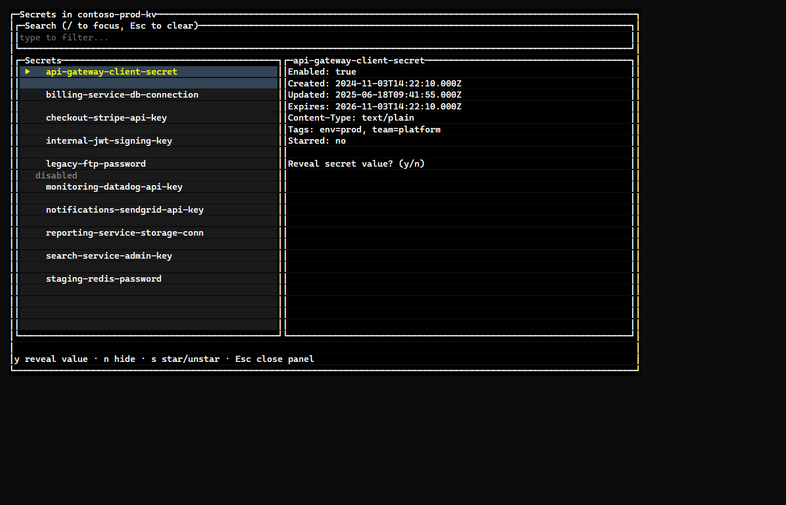

+++
title = 'Key Vault Console Port'
date = 2026-09-10T00:00:00-06:00
tags = ["typescript", "dotnet", "azure", "cli"]
+++

In my personal workflow we use Azure and its services, which means Azure Key Vault is our default secrets manager. In our different envs we're storing a lot of secrets, probably too many, and searching them can be a real pain. The Azure portal UI doesn't give the greatest options when it comes to filtering and search. Probably a sign that it's not designed as a catch-all, but that's a different problem.

Because of this I decided to write a simple .NET CLI application to make finding secrets a little easier. It's a read-only lookup tool that uses your Azure identity to see what you have access to. I had three goals to make lookups faster and easier.

1. Lazily load the list so flipping through the results is easier
2. Add search functionality
3. Star frequently looked-up secrets for quick access

The Azure SDK is similar to its UI here: there's no search and only basic pagination, so I had to add some additional logic around those to get the user experience I wanted. Being a .NET shop I defaulted to writing the console app in .NET using [Spectre](https://spectreconsole.net/) for the TUI - which turned out great.

Needless to say this is a company application, but I wanted to take what I did and port it over to a TypeScript version. I've been writing more applications in TypeScript to keep my general knowledge up to date outside of .NET. I ended up using [OpenTUI](https://opentui.com/) for the TUI and the Microsoft packages for the identity logic. It's pretty basic but extremely handy.

### Screenshots

Rendered from mock data, not a real vault.

Link: https://github.com/andrewrady/azure-kv-tui
