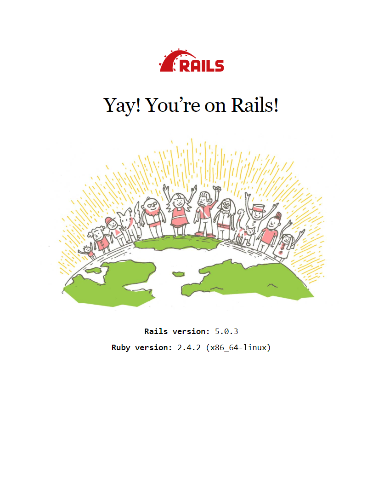

+++
title = "Rails Windows Development"
date = 2019-02-16T23:47:32-07:00
tags = ["rails", "wsl"]
draft = false
+++

## Rails development on Windows

Developing Rails applications on windows has always been a pain. It's simple enough to install ruby and the need gems to get a basic Rails application started, but in time developers will run into problems. A lot of gem work fine in a windows environment, but some do not compile down correctly and this is the main issue with developing on Windows. For this reason many people who need to work on Rails applications are running their development environment on OSX or Linux, including me. With Windows WSL I decided to see if I can get a working, acceptable development environment on a Windows computer. After some trail and error (plus some help from google) it's pretty good.

## Windows Subsystem for Linux (WSL)

Microsoft now lets us install Linux distro system directly on our windows computer easily from the Microsoft Store. Before we do this though we need to open Powershell as an Admin run
```
Enable-WindowsOptionalFeature -Online -FeatureName Microsoft-Windows-Subsystem-Linux
```
and then restart our computer. The easiest way to install a Linux distro is from the Windows Store, just open it up and search for your preferred distro. Personally I am using Ubuntu because I have the most experience with that one. For more details on installing WSL on windows [check out this article](https://docs.microsoft.com/en-us/windows/wsl/install-win10). If we search for Ubuntu from the Windows search it will open a terminal that we can setup everything.

## Setting up our Environment

For now we are going to do a simple install and talk about a few gotchas developing with WSL. Normally I would recommend installing Ruby using RVM so you can easily change versions if need be. For now lets just do a simple install of ruby. First update our new system and then install ruby 

```
sudo apt-get update
```
```
sudo apt-get install ruby-full
```

We can check our install and the version with
```
ruby -v
```
and we should get a result similar too 
```
ruby 2.4.2p198 (2017-09-14 revision 59899) [x86_64-linux]
```

Now we need to install Bundler which is a package manager similar to npm for node development. We can do this with
```
gem install bundler
```

and finally lets install Rails!
```
gem install rails
```

There we go, a full Linux environment to develop rails applications without any compatibility issues. We can spin up a project and run it.

```
rails new test_app
cd test_app
rails s
```

From there we can see the front page showing we are running a rails application 


## But wait theres more!
If you are a vim user you are good, but us new kids to the block who uses flashy text editors then there is one small gotcha. Window doesn't want you going into the WSL and manually editing files. This can causes us problems if you use something like vscode. After some research Microsoft has setup a directory to work on project and be able to open them on the Windows side and work like normal. In the WSL terminal we can get to this by,
```
cd /mnt/c/dev/
```
please note that the `c` in the path is your hard drive. So if you have changed this change the path to reflex that. In this directory we can store our Rails applications and open them with any text editor or IDE!
